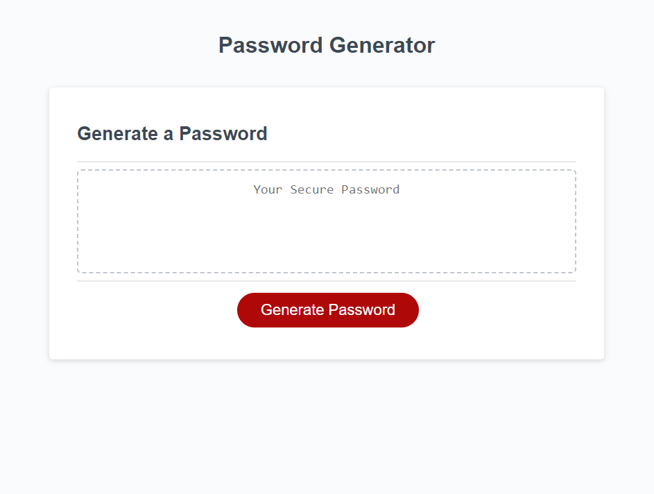

# Password Generator

## Description

This project is a webpage containing an online password generator. It can be used to generate a unique password of up to 128 characters.

## Installation

The webpage is hosted online and can be accessed using the following link: https://christiehyde.github.io/PasswordGenerator/

## Usage

A screenshot of the webpage is provided:

Users can click the "Generate Password" button to bring up a series of prompts to determine which types of characters should appear in the password, as well as the desired length of the password. Then a password will be generated using those criteria and displayed on the page, which can then be copied for personal use.

## Credits
The JavaScript code from line 22 onward, and the provided webpage screenshot, were produced by Christie Hyde for this project.
All HTML and CSS source code, as well as all JavaScript code up to line 22, were provided to me by the University of Western Australia Coding Boot Camp course and are not my original creations.